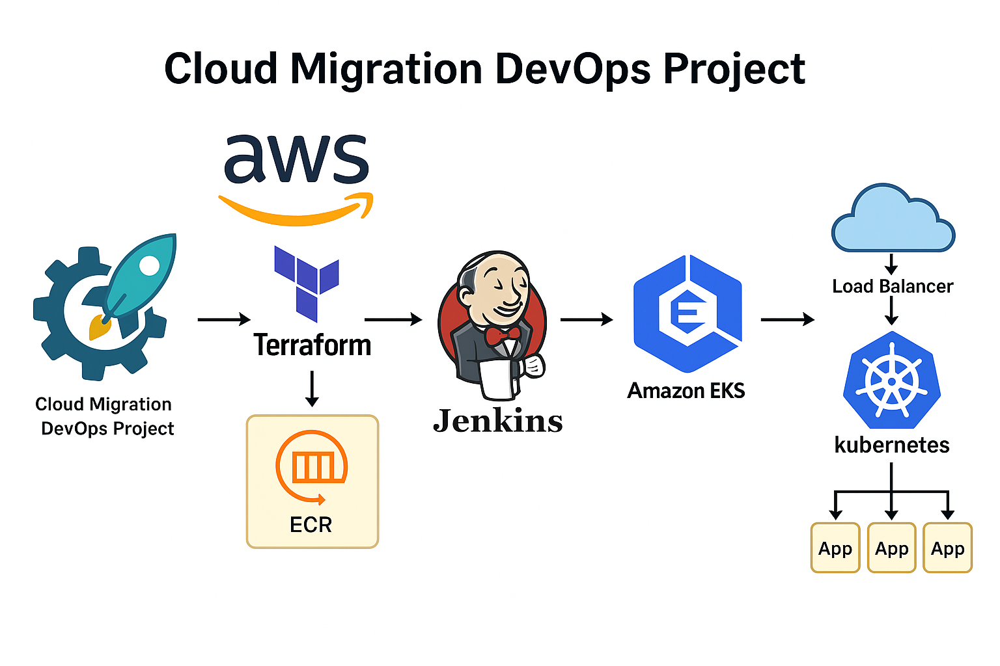
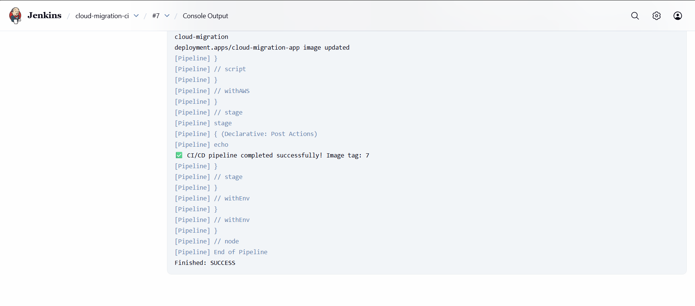
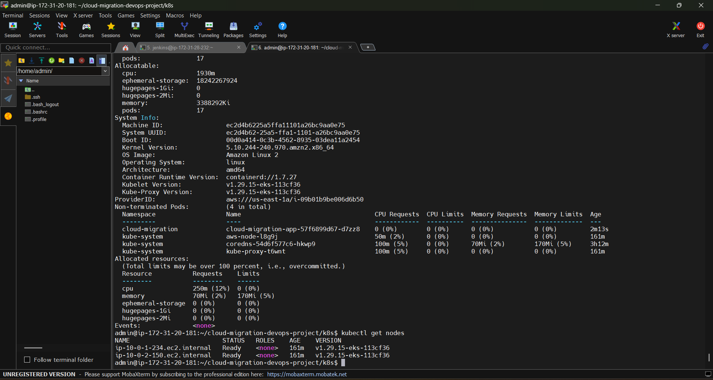

# ☁️ Cloud Migration DevOps Project

## 🚀 Overview
This project demonstrates a complete **CI/CD pipeline** that deploys a Python-based web application to **Amazon EKS** using modern DevOps tools — **Jenkins**, **Docker**, **Terraform**, and **AWS ECR**.

---

## 🏗️ Architecture

### Tools Used
- **GitHub** – Source Code Management & Webhook trigger  
- **Jenkins** – CI/CD Automation Server  
- **Docker** – Containerization of the application  
- **AWS ECR** – Private image repository  
- **Terraform** – Infrastructure as Code (EKS, VPC, IAM, Subnets)  
- **Kubernetes (EKS)** – Orchestration and scaling of containers  
- **AWS IAM** – Authentication and secure role management  

---

## 📁 Folder Structure

cloud-migration-devops-project/

├── app/
│ ├── app.py
│ ├── requirements.txt
│ └── Dockerfile
│
├── jenkins/
│ └── Jenkinsfile
│
├── terraform/
│ ├── main.tf
│ ├── provider.tf
│ └── variables.tf (optional)
│
├── k8s/
│ ├── namespace.yaml
│ ├── deployment.yaml
│ └── service.yaml
│
├── architecture/
│ └── cloud-migration-architecture.png
│
├── images/
│ ├── jenkins-build-success.png
│ ├── ecr-image.png
│ ├── eks-deployment.png
│ └── app-output.png
│
└── README.md

---

## ⚙️ CI/CD Pipeline Flow

1. **Developer commits code → GitHub Webhook triggers Jenkins**
2. **Jenkins builds Docker image** and tags it with build number  
3. **Pushes image to AWS ECR**  
4. **Updates Kubernetes Deployment** on Amazon EKS  
5. **Kubernetes LoadBalancer Service** exposes app publicly  
6. User accesses app via external ELB endpoint

---

## 🧠 Features
- Fully automated **build → deploy** pipeline  
- Infrastructure provisioned via **Terraform**  
- Secure AWS integration using **Jenkins credentials**  
- Zero-downtime deployments using **Kubernetes rolling updates**

---

## 🖼️ Screenshots

| Description | Screenshot |
|--------------|-------------|
| Jenkins Build Success |  |
| EKS Deployment |  |
| Application Output |  |

---

## 👨‍💻 Author
**Abhin A**  
DevOps Engineer | Cloud & CI/CD Automation Enthusiast 🌩️

